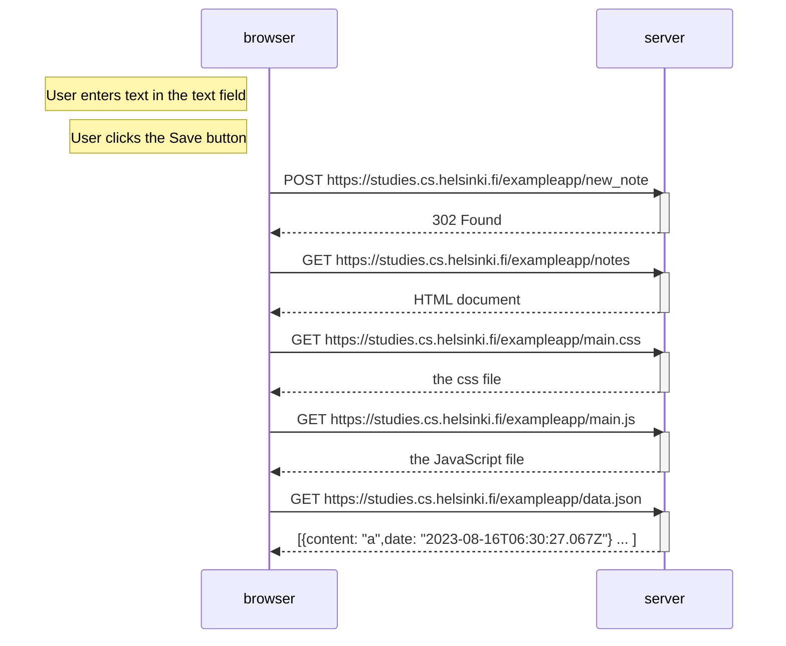
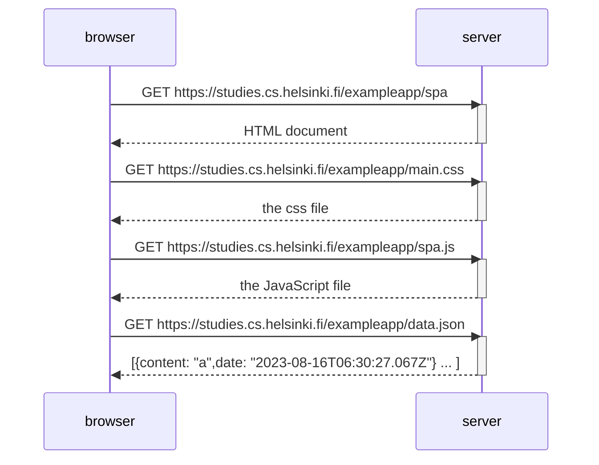
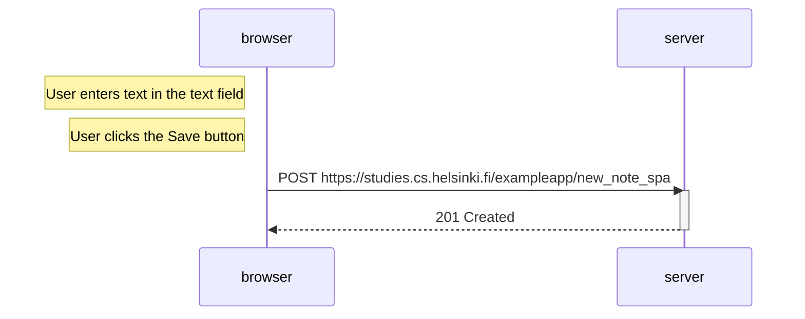

# 0.1: HTML
Review the basics of HTML by reading this tutorial from Mozilla: HTML tutorial.

This exercise is not submitted to GitHub, it's enough to just read the tutorial

# 0.2: CSS
Review the basics of CSS by reading this tutorial from Mozilla: CSS tutorial.

This exercise is not submitted to GitHub, it's enough to just read the tutorial

# 0.3: HTML forms
Learn about the basics of HTML forms by reading Mozilla's tutorial Your first form.

This exercise is not submitted to GitHub, it's enough to just read the tutorial

# 0.4: New note diagram

# 0.5: Single page app diagram

# 0.6: New note in Single page app diagram

